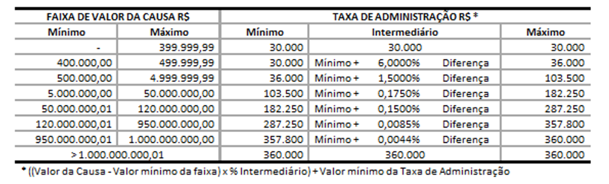
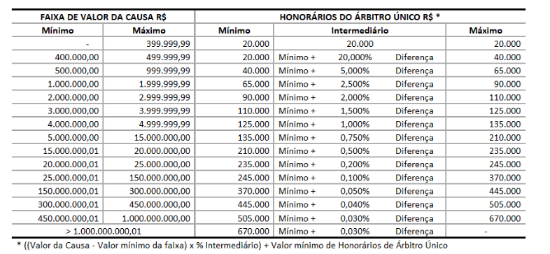
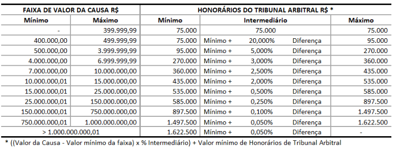

# Calculadora/Comparadora de Custas de Arbitragem
### CCBC
##### Registro:
5.000

##### Taxa de Administração
| Faixa (em R$)               | Valor (em R$)                                           |
|-----------------------------|---------------------------------------------------------|
| 0 - 4.000.000               | 131.994,46                                              |
| 4.000.000 - 10.000.000      | 131.994,46 + 0,2639889% do que extrapolar 4.000.000     |
| 10.000.000 - 18.000.000     | 147.833,80 + 0,2375900% do que extrapolar 10.000.000    |
| 18.000.000 - 50.000.000     | 166.841,00 + 0,2111911% do que extrapolar 18.000.000    |
| 50.000.000 - 100.000.000    | 234.422,16 + 0,1847922% do que extrapolar 50.000.000    |
| 100.000.000 - 150.000.000   | 326.818,28 + 0,1319945% do que extrapolar 100.000.000   |
| 150.000.000 - 300.000.000   | 392.815,51 + 0,0131994% do que extrapolar 150.000.000   |
| 300.000.000 - 500.000.000   | 412.614,68 + 0,0065997% do que extrapolar 300.000.000   |
| 500.000.000 - 1.000.000.000 | 425.814,13 + 0,0032999% do que extrapolar 500.000.000   |
| 1.000.000.000 - infinite    | 442.313,44 + 0,0016499% do que extrapolar 1.000.000.000 |

##### Honorários de Árbitros (3 árbitros)
| Valor da causa (R$)         | Honorários do Tribunal Trino (R$ + % da diferença)             |
|-----------------------------|----------------------------------------------------------------|
| 0 – 2.000.000               | 296.987,54                                                     |
| 2.000.000 - 4.000.000       | 296.987,54 + 4,949792268750% do que extrapolar 2.000.000       |
| 4.000.000 - 10.000.000      | 395.983,38 + 3,563850433500% do que extrapolar 4.000.000       |
| 10.000.000 - 18.000.000     | 609.814,41 + 1,187950144500% do que extrapolar 10.000.000      |
| 18.000.000 - 50.000.000     | 704.850,42 + 0,395983381500% do que extrapolar 18.000.000      |
| 50.000.000 - 100.000.000    | 831.565,10 + 0,356385043350% do que extrapolar 50.000.000      |
| 100.000.000 - 150.000.000   | 1.009.757,62 + 0,237590028900% do que extrapolar 100.000.000   |
| 150.000.000 - 300.000.000   | 1.128.552,64 + 0,158393352600% do que extrapolar 150.000.000   |
| 300.000.000 - 500.000.000   | 1.366.142,67 + 0,118795014450% do que extrapolar 300.000.000   |
| 500.000.000 - 1.000.000.000 | 1.603.732,70 + 0,098995845375% do que extrapolar 500.000.000   |
| 1.000.000.000 – infinite    | 2.098.711,92 + 0,079196676300% do que extrapolar 1.000.000.000 |

##### Honorários de Árbitros (1 árbitro)
| Valor da causa (R$)         | Honorários do árbitro único (R$ + % da diferença)           |
|-----------------------------|-------------------------------------------------------------|
| 0 – 2.000.000               | 118.795,01                                                  |
| 2.000.000 - 4.000.000       | 118.795,01 + 1,97991690750% do que extrapolar 2.000.000     |
| 4.000.000 - 10.000.000      | 158.393,35 + 1,42554017340% do que extrapolar 4.000.000     |
| 10.000.000 - 18.000.000     | 243.925,76 + 0,47518005780% do que extrapolar 10.000.000    |
| 18.000.000 - 50.000.000     | 281.940,17 + 0,15839335260% do que extrapolar 18.000.000    |
| 50.000.000 - 100.000.000    | 332.626,04 + 0,14255401734% do que extrapolar 50.000.000    |
| 100.000.000 - 150.000.000   | 403.903,05 + 0,09503601156% do que extrapolar 100.000.000   |
| 150.000.000 - 300.000.000   | 451.421,05 + 0,06335734104% do que extrapolar 150.000.000   |
| 300.000.000 - 500.000.000   | 546.457,07 + 0,04751800578% do que extrapolar 300.000.000   |
| 500.000.000 - 1.000.000.000 | 641.493,08 + 0,03959833815% do que extrapolar 500.000.000   |
| 1.000.000.000 – infinite    | 839.484,77 + 0,03167867052% do que extrapolar 1.000.000.000 |

* O Presidente do Tribunal Arbitral receberá os valores correspondentes a 40% dos honorários e os demais árbitros receberão, cada qual, 30% dos honorários do tribunal arbitral trino.

#### Arbitragem Expedita
##### Registro:
5.000

##### Taxa de Administração
| Valor em Disputa (R$) | Taxa de administração (R$ + % da diferença) |
|-----------------------|---------------------------------------------|
| 0 – 1.000.000         | 30.000                                      |
| 1.000.000 - 2.000.000 | 30.000 + 0,90% do que extrapolar 1.000.000  |
| 2.000.000 - infinite  | 39.000 + 0,90% do que extrapolar 2.000.000  |

##### Honorários de Árbitros (1 árbitro)
| Valor em Disputa (R$) | Honorários do Árbitro Único (R$ + % da diferença) |
|-----------------------|---------------------------------------------------|
| 0 – 1.000.000         | 45.000                                            |
| 1.000.000 - 2.000.000 | 45.000 + 1,40% do que extrapolar 1.000.000        |
| 2.000.000 - 3.000.000 | 59.000 + 1,40% do que extrapolar 2.000.000        |

##### Honorários de Árbitros (3 árbitros)
| Valor em Disputa (R$) | Honorários do Tribunal Arbitral (R$ + % da diferença)        |
|-----------------------|--------------------------------------------------------------|
| 0 – 1.000.000         | 119.999,70                                                   |
| 1.000.000 - 2.000.000 | 119.999,70 + 3,733324% do que extrapolar 1.000.000           |
| 2.000.000 - 3.000.000 | 157.332,94 + 3,733324% do que extrapolar 2.000.000           |

***

### CAMARB
##### Registro
5.000

##### Taxa de Administração
| Faixa                      | Valor                                                  |
|----------------------------|--------------------------------------------------------|
| 0 até 500.000              | 14.040                                                 |
| 500.000 até 1.000.000      | 14.040 + 1,980% sobre o que exceder 500.000            |
| 1.000.001 até 5.000.000    | 23.940 + 1,170% sobre o que exceder 1.000.000          |
| 5.000.001 até 10.000.000   | 70.740 + 0,486% sobre o que exceder 5.000.000          |
| 10.000.001 até 15.000.000  | 95.040 + 0,216% sobre o que exceder 10.000.000         |
| 15.000.001 até 20.000.000  | 105.840 + 0,162% sobre o que exceder 15.000.000        |
| 20.000.001 até 50.000.000  | 113.940 + 0,126% sobre o que exceder 20.000.000        |
| 50.000.001 até 100.000.000 | 151.740 + 0,072% sobre o que exceder 50.000.000        |
| 100.000.001 – infinite     | 187.740 + 0,026% sobre o que exceder 100.000.000,00.   |

* Limitado à 360.000

##### Taxa de Honorários
| Faixa                          | Valor                                            |
|--------------------------------|--------------------------------------------------|
| 0 até 500.000                  | 20.930                                           |
| 500.001 até 1.000.000          | 20.930 + 3,250% sobre o que exceder 500.000      |
| 1.000.001 até 1.500.000        | 37.180 + 2,470% sobre o que exceder 1.000.000    |
| 1.500.001 até 2.000.000        | 49.530 + 1,456% sobre o que exceder 1.500.000    |
| 2.000.001 até 5.000.000        | 56.810 + 0,845% sobre o que exceder 2.000.000    |
| 5.000.001 até 10.000.000       | 82.160 + 0,780% sobre o que exceder 5.000.000    |
| 10.000.001 até 15.000.000      | 121.160 + 0,650% sobre o que exceder 10.000.000  |
| 15.000.001 até 20.000.000      | 153.660 + 0,390% sobre o que exceder 15.000.000  |
| 20.000.001 até 30.000.000      | 173.160 + 0,195% sobre o que exceder 20.000.000  |
| 30.000.001 até 40.000.000      | 192.660 + 0,130% sobre o que exceder 30.000.000  |
| 40.000.001 até 50.000.000      | 205.660 + 0,091% sobre o que exceder 40.000.000  |
| 50.000.001 até 100.000.000     | 214.760 + 0,065% sobre o que exceder 50.000.000  |
| 100.000.001 até 200.000.000    | 247.260 + 0,052% sobre o que exceder 100.000.000 |
| 200.000.001 até 500.000.000    | 299.260 + 0,026% sobre o que exceder 200.000.000 |
| 500.000.001 –                  | 455.000 + 0,013% sobre o que exceder 500.000.000 |

* Caso a arbitragem seja conduzida por tribunal o presidente recebera o valor acrescido em 15%.
* Sendo a arbitragem conduzida por árbitro único, o valor de honorários será igual ao valor de referência acima acrescido em 30%

#### Arbitragem Expedita
* Taxa de Administração e Honorários de Árbitros é reduzido em 30%.

***

### ICCWBO
When a case is submitted to more than one arbitrator, the Court, at its discretion, shall have the right to increase the total fees up to a maximum which shall normally not exceed three times the fees of one arbitrator.
##### Registro:
5.000 USD

##### Taxa de Administração
| Faixa  USD                 | Valor USD  |
|----------------------------|------------|
| 0 - $50.000                | $5.000     |
| $50.001 - $100.000         | 1,53%      |
| $100.001 - $200.000        | 2,72%      |
| $200.001 - $500.000        | 2,25%      |
| $500.001 - $1.000.000      | 1,62%      |
| $1.000.001 - $2.000.000    | 0,788%     |
| $2.000.001 - $5.000.000    | 0,46%      |
| $5.000.001 - $10.000.000   | 0,25%      |
| $10.000.001 - $30.000.000  | 0,10%      |
| $30.000.001 - $50.000.000  | 0,09%      |
| $50.000.001 - $80.000.000  | 0,01%      |
| $80.000.001 - $500.000.000 | 0,0123%    |
| over $500.000.000          | $150.000   |

##### Honorários de Árbitros
| Faixa USD                   | Valor USD           |
|-----------------------------|---------------------|
| 0 - $50.000                 | $3.000 or 18,0200%  |
| $50.001 - $100.000          | 2,6500% or 13,5680% |
| $100.001 - $200.000         | 1,4310% or 7,6850%  |
| $200.001 - $500.000         | 1,3670% or 6,8370%  |
| $500.001 - $1.000.000       | 0,9540% or 4,0280%  |
| $1.000.001 - $2.000.000     | 0,6890% or 3,6040%  |
| $2.000.001 - $5.000.000     | 0,3750% or 1,3910%  |
| $5.000.001 - $10.000.000    | 0,1280% or 0,9100%  |
| $10.000.001 - $30.000.000   | 0,0640% or 0,2410%  |
| $30.000.001 - $50.000.000   | 0,0590% or 0,2280%  |
| $50.000.001 - $80.000.000   | 0,0330% or 0,1570%  |
| $80.000.001 - $100.000.000  | 0,0210% or 0,1150%  |
| $100.000.001 - $500.000.000 | 0,0110% or 0,0580%  |
| $500.000.000 - infinite     | 0,0100% or 0,0400%  |

#### Arbitragem Expedita
##### Registro:
5.000 USD

##### Taxa de Administração
| Faixa USD                  | Valor USD |
|----------------------------|-----------|
| 0 - $50.000                | $5.000    |
| $50.001 - $100.000         | 1,53%     |
| $100.001 - $200.000        | 2,72%     |
| $200.001 - $500.000        | 2,25%     |
| $500.001 - $1.000.000      | 1,62%     |
| $1.000.001 - $2.000.000    | 0,788%    |
| $2.000.001 - $5.000.000    | 0,46%     |
| $5.000.001 - $10.000.000   | 0,25%     |
| $10.000.001 - $30.000.000  | 0,10%     |
| $30.000.001 - $50.000.000  | 0,09%     |
| $50.000.001 - $80.000.000  | 0,01%     |
| $80.000.001 - $500.000.000 | 0,0123%   |
| $500.000.000 - infinite    | $150.000  |

##### Honorários de Árbitros
| Faixa USD                   | Valor USD          |
|-----------------------------|--------------------|
| 0 - $50.000                 | $2.400 - 14,4160%  |
| $50.001 - $100.000          | 2,1200% - 10,8544% |
| $100.001 - $200.000         | 1,1448% - 6,1480%  |
| $200.001 - $500.000         | 1,0936% - 5,4696%  |
| $500.001 - $1.000.000       | 0,7632% - 3,2224%  |
| $1.000.001 - $2.000.000     | 0,5512% - 2,8832%  |
| $2.000.001 - $5.000.000     | 0,3000% - 1,1128%  |
| $5.000.001 - $10.000.000    | 0,1024% - 0,7280%  |
| $10.000.001 - $30.000.000   | 0,0512% - 0,1928%  |
| $30.000.001 - $50.000.000   | 0,0472% - 0,1824%  |
| $50.000.001 - $80.000.000   | 0,0264% - 0,1256%  |
| $80.000.001 - $100.000.000  | 0,0168% - 0,0920%  |
| $100.000.001 - $500.000.000 | 0,0088% - 0,0464%  |
| $500.000.000 - infinite     | 0,0080% - 0,0320%  |

***

### AMCHAM
* Os valores abaixo indicados deverão ser multiplicados pelo número
  de árbitros(as).
* Associados têm desconto.

##### Registro
4.500

##### Taxa de Administração
| Mensalidades para disputas                 | Valor para Reclamado (R$) |
|--------------------------------------------|----------------------------|
| até R$ 10.000.000,00                       | R$ 3.000,00                |
| de R$ 10.000.000,01 a R$ 50.000.000,00     | R$ 3.400,00                |
| de R$ 50.000.000,01 a R$ 100.000.000,00    | R$ 3.800,00                |
| de R$ 100.000.000,01 a R$ 500.000.000,00   | R$ 4.500,00                |
| acima de R$ 500.000.000,00                 | R$ 5.400,00                |

##### Honorários de Árbitros
| Valor em Disputa (R$)                   | Honorários dos árbitros (R$) |
|-----------------------------------------|------------------------------|
| Até R$ 500.000,00                       | R$ 36.180,00                 |
| De R$ 500.000,01 até R$ 1 milhão        | R$ 50.220,00                 |
| De R$ 1.000.000,01 até R$ 3 milhões     | R$ 61.020,00                 |
| De R$ 3.000.000,01 até R$ 5 milhões     | R$ 89.000,00                 |
| De R$ 5.000.000,01 até R$ 10 milhões    | R$ 122.580,00                |
| De R$ 10.000.000,01 até R$ 25 milhões   | R$ 156.060,00                |
| De R$ 25.000.000,01 até R$ 40 milhões   | R$ 178.200,00                |
| De R$ 40.000.000,01 até R$ 60 milhões   | R$ 199.800,00                |
| De R$ 60.000.000,01 até R$ 80 milhões   | R$ 221.400,00                |
| De R$ 80.000.000,01 até R$ 100 milhões  | R$ 251.100,00                |
| De R$ 100.000.000,01 até R$ 200 milhões | R$ 278.640,00                |
| De R$ 200.000.000,01 até R$ 500 milhões | R$ 306.720,00                |
| De R$ 500.000.000,01 até R$ 1 bilhão    | R$ 334.800,00                |
| Acima de R$ 1 bilhão                    | R$ 446.580,00                |

#### Arbitragem Expedita
##### Registro
3.200

##### Taxa de Administração
Incidência de cobrança de mensalidades para
casos excepcionais de longa duração [para casos
em que a duração do procedimento arbitral
superar 10 (dez) meses], que serão devidas até o
encerramento do caso, conforme Artigo 2.4 do
Anexo II do Regulamento de Arbitragem Expedita. - 2.300

| Valor em Disputa (R$)                  | Não Associado AMCHAM |
|----------------------------------------|----------------------|
| Até R$100.000,00                       | R$ 19.000,00         |
| R$100.001,00 a R$200.000,00            | R$ 21.000,00         |
| R$200.001,00 a R$500.000,00            | R$ 24.000,00         |
| R$500.001,00 a R$800.000,00            | R$ 31.000,00         |
| R$800.001,00 a R$1.500.000,00          | R$ 34.000,00         |
| R$1.500.001,00 a R$2.000.000,00        | R$ 37.000,00         |
| R$2.000.001,00 a R$2.500.000,00        | R$ 39.000,00         |
| R$2.500.001,00 a R$3.000.000,00        | R$ 41.000,00         |
| R$3.000.001,00 a R$8.000.000,00        | R$ 47.000,00         |
| Acima de R$8.000.001,00                | R$ 53.000,00         |

##### Honorários de Árbitros
| Valor em Disputa (R$)                       | valor                                                   |
|---------------------------------------------|---------------------------------------------------------|
| Até R$100.000,00                            | R$ 20.000,00                                            |
| De R$100.001,00 a R$200.000,00              | R$ 20.000,00 + 4% da quantia acima de R$100.000,00      |
| De R$200.001,00 a R$500.000,00              | R$ 24.000,00 + 2,5% da quantia acima de R$200.000,00    |
| De R$500.001,00 a R$800.000,00              | R$ 31.500,00 + 1% da quantia acima de R$500.000,00      |
| De R$800.001,00 a R$1.500.000,00            | R$ 34.500,00 + 0,65% da quantia acima de R$800.000,00   |
| De R$1.500.001,00 a R$2.000.000,00          | R$ 39.050,00 + 0,45% da quantia acima de R$1.500.000,00 |
| De R$2.000.001,00 a R$2.500.000,00          | R$ 41.300,00 + 0,4% da quantia acima de R$2.000.000,00  |
| De R$2.500.001,00 a R$3.000.000,00          | R$ 43.500,00 + 0,3% da quantia acima de R$2.500.000,00  |
| Acima de R$3.000.000,00                     | R$ 50.000,00 + 0,3% da quantia acima de R$3.000.000,00  |
* Teto de R$150.000,00                     

***

### CAM
   Taxa de administração é calculada por mês e honorários dos árbitros é calculado baseado na quantidade de horas trabalhadas pelos árbitros

***

### FIESP
##### Registro:
1% do valor da disputa sendo o mínimo 3.000 e máximo 5.000

##### Taxa de Administração

##### Honorários de Árbitros (1 árbitro)

##### Honorários de Árbitros (3 árbitros)

#### Arbitragem Expedita
##### Registro:
| De              | Até               | Taxa R$       |
|-----------------|-------------------|---------------|
| -               | R$ 400.000,00     | R$ 2.100,00   |
| R$ 400.000,01   | R$ 500.000,00     | R$ 2.800,00   |
| R$ 500.000,01   | R$ 1.000.000,00   | R$ 3.200,00   |
| R$ 1.000.000,01 | R$ 1.500.000,00   | R$ 3.600,00   |
| R$ 1.500.000,01 | R$ 2.000.000,00   | R$ 4.000,00   |

##### Taxa de Administração
| De              | Até               | Taxa R$        |
|-----------------|-------------------|----------------|
| -               | R$ 400.000,00     | R$ 21.000,00   |
| R$ 400.000,01   | R$ 500.000,00     | R$ 22.500,00   |
| R$ 500.000,01   | R$ 1.000.000,00   | R$ 28.800,00   |
| R$ 1.000.000,01 | R$ 1.500.000,00   | R$ 33.800,00   |
| R$ 1.500.000,01 | R$ 2.000.000,00   | R$ 38.800,00   |

##### Honorários de Árbitros (1 árbitro)
| De                | Até              | Taxa R$       |
|-------------------|------------------|---------------|
| -                 | R$ 100.000,00    | R$ 14.000,00  |
| R$ 100.000,01     | R$ 200.000,00    | R$ 15.500,00  |
| R$ 200.000,01     | R$ 300.000,00    | R$ 17.000,00  |
| R$ 300.000,01     | R$ 400.000,00    | R$ 18.000,00  |
| R$ 400.000,01     | R$ 500.000,00    | R$ 19.000,00  |
| R$ 500.000,01     | R$ 1.000.000,00  | R$ 32.000,00  |
| R$ 1.000.000,01   | R$ 1.500.000,00  | R$ 39.000,00  |
| R$ 1.500.000,01   | R$ 2.000.000,00  | R$ 45.500,00  |

***

### FGV
##### Registro:
5.000

##### Taxa de Administração
| Faixa R$                   | Valor R$ | Taxa de Ajuste | Limite Superior |
|----------------------------|----------|----------------|-----------------|
| Até 5.000.000              | 50.000   | -              | 50.000          |
| De 5.000.000 a 14.999.999  | 50.000   | 0,4%           | 90.000          |
| De 15.000.000 a 29.999.999 | 90.000   | 0,3%           | 135.000         |
| De 30.000.000 a 49.999.999 | 135.000  | 0,2%           | 175.000         |
| De 50.000.000 a 99.999.999 | 175.000  | 0,1%           | 225.000         |
| De 100.000.000 e mais      | 225.000  | 0,05%          | infinite        |

##### Honorários de Árbitros (3 árbitros)
| MONTANTE EM LITÍGIO         | MÍNIMO                       | MÁXIMO                    |
|-----------------------------|------------------------------|---------------------------|
|                             |                              |                           |
| Até 5.000.000               | 60.000                       | 95.000                    |
| De 5.000.000 a 14.999.999   | 110.000                      | 180.000                   |
| De 15.000.000 a 29.999.999  | 125.000                      | 200.000                   |
| De 30.000.000 a 49.999.999  | 145.000                      | 255.000                   |
| De 50.000.000 a 99.999.999  | 180.000                      | 300.000                   |
| De 100.000.000 e mais       | 300.000                      | .....                     |

***

### CBMA
Desconto associado

##### Registro:
4.000

##### Taxa de Administração
| Faixa                  | Valor    |
|------------------------|----------|
| Até R$ 500 mil        | R$ 15 mil |
| Até R$ 1 milhão       | R$ 25 mil |
| Até R$ 3 milhões      | R$ 45 mil |
| Até R$ 5 milhões      | R$ 65 mil |
| Até R$ 10 milhões     | R$ 90 mil |
| Até R$ 25 milhões     | R$ 120 mil |
| Até R$ 50 milhões     | R$ 160 mil |
| Até R$ 100 milhões    | R$ 230 mil |
| A partir de R$ 100 milhões | A partir de R$ 230 mil até limite a ser fixado pelo CBMA |

##### Honorários de Árbitros
| Valor da Demanda Honorários Arbitrais (por árbitro) | Faixa                   |
|-----------------------------------------------------|-------------------------|
| Até R$ 500 mil                                     | R$ 18 mil a R$ 30 mil  |
| Até R$ 1 milhão                                    | R$ 30 mil a R$ 45 mil  |
| Até R$ 3 milhões                                   | R$ 50 mil a R$ 75 mil  |
| Até R$ 5 milhões                                   | R$ 85 mil a R$ 120 mil |
| Até R$ 10 milhões                                  | R$ 120 mil a R$ 150 mil|
| Até R$ 25 milhões                                  | R$ 180 mil a R$ 220 mil|
| Até R$ 50 milhões                                  | R$ 220 mil a R$ 250 mil|
| A partir de R$ 100 milhões                         | R$ 380 mil até valor a ser fixado pelo CBMA |

* Em caso de Árbitro Único, os honorários poderão ser majorados pelo CBMA em até 20% com relação ao valor máximo indicado em cada faixa da tabela.

#### Arbitragem Expedita
árbitro único

##### Registro:
4.000

##### Taxa de Administração
*  A taxa de administração do procedimento arbitral devida ao CBMA corresponde a 1% (um por cento) do valor da causa, obedecido o piso de R$ 5 mil (cinco mil reais).

##### Honorários de Árbitros
Os honorários do árbitro correspondem a 3% (três por cento) do valor da causa, obedecido o piso de R$ 15 mil (quinze mil reais) e o teto de R$ 100 mil(cem mil reais).

***

### ARBITAC
##### Registro:
| FAIXA (em R$)        | VALOR(em R$) |
|----------------------|--------------|
| 0-1.000.000          | 1.500        |
| 1.000.000-5.000.000  | 3.000        |
| 5.000.000-infinite   | 5.000        |

##### Taxa de Administração
| Faixa (em R$)            | Valor (em R$)                                  |
|--------------------------|------------------------------------------------|
| 0 - 50.000               | 2.500                                          |
| 50.000 - 500.000         | 2.500 + 2% do que extrapolar 50.000            |
| 500.000- 1.000.000       | 11.500 + 1,5% do que extrapolar 500.000        |
| 1.000.000 - 5.000.000    | 19.000 + 1% do que extrapolar 1.000.000        |
| 5.000.000 - 10.000.000   | 59.000 + 0,5% do que extrapolar 5.000.000      |
| 10.000.000 - 20.000.000  | 84.000 + 0,2% do que extrapolar 10.000.000     |
| 20.000.000 - 50.000.000  | 104.000 + 0,1 % do que extrapolar 20.000.000   |
| 50.000.000 - 100.000.000 | 134.000 + 0,05 % do que extrapolar 50.000.000  |
| 100.000.000, - infinite  | 159.000 + 0,025% do que extrapolar 100.000.000 |
* Limite máximo: 300.000

##### Honorários de Árbitros
| Faixa (em R$)              | Valor (em R$)                                  |
|----------------------------|------------------------------------------------|
| 0 - 50.000                 | 3.000                                          |
| 50.000 - 200.000           | 3.000 + 4% do que extrapolar 50.000            |
| 200.000 - 500.000          | 9.000 + 3,5% do que extrapolar 200.000         |
| 500.000 - 1.000.000        | 19.500 + 2,5% do que extrapolar 500.000        |
| 1.000.000 - 5.000.000      | 32.000 + 1% do que extrapolar 1.000.000        |
| 5.000.000 - 10.000.000     | 72.000 + 0,6% do que extrapolar 5.000.000      |
| 10.000.000 - 20.000.000    | 102.000 + 0,3% do que extrapolar 10.000.000    |
| 20.000.000 - 50.000.000    | 132.000 + 0,2% do que extrapolar 20.000.000    |
| 50.000.000 - 100.000.000   | 192.000 + 0,1% do que extrapolar 50.000.000    |
| 100.000.000 - 500.000.000  | 242.000 + 0,05% do que extrapolar 100.000.000  |
| 500.000.000 - infinite     | 442.000 + 0,025% do que extrapolar 500.000.000 |

* Disputas de até 2.000.000 serão tratadas por 1 único árbitro, enquanto disputas de valores maiores serão tratadas por 3 árbitros onde o primeiro recebe o valor da tabela e os outros 2 recebem 75% do valor da tabela

#### Arbitragem Expedita
O valor da Taxa de Administração é reduzido em 30%

***

### CAMFIEP
##### Registro
| Faixa (em R$)        | Valor (em R$) |
|----------------------|---------------|
| 0 - 500.000          | 1.000         |
| 500.000 - 1.000.000  | 2.000         |
| 1.000.000 - infinite | 3.000         |

##### Taxa de Administração
2% do valor da disputa com limite de 70.000

##### Honorários de Árbitros
| Faixa (em R$)             | Valor Fixo (R$) | Adicional (% da diferença)            |
|---------------------------|-----------------|---------------------------------------|
| 0 - 200.000               | 5.000           | -                                     |
| 200.000 - 500.000         | 5.000           | 3,70% do valor superior a 200.000     |
| 500.000 - 1.000.000       | 16.100          | 2,50% do valor superior a 500.000     |
| 1.000.000 - 1.500.000     | 28.600          | 1,90% do valor superior a 1.000.000   |
| 1.500.000 - 2.000.000     | 38.100          | 1,12% do valor superior a 1.500.000   |
| 2.000.000 - 5.000.000     | 43.700          | 0,65% do valor superior a 2.000.000   |
| 5.000.000 - 10.000.000    | 63.200          | 0,60% do valor superior a 5.000.000   |
| 10.000.000 - 15.000.000   | 93.200          | 0,50% do valor superior a 10.000.000  |
| 15.000.000 - 20.000.000   | 118.200         | 0,30% do valor superior a 15.000.000  |
| 20.000.000 - 30.000.000   | 133.200         | 0,15% do valor superior a 20.000.000  |
| 30.000.000 - 40.000.000   | 148.200         | 0,10% do valor superior a 30.000.000  |
| 40.000.000 - 50.000.000   | 158.200         | 0,07% do valor superior a 40.000.000  |
| 50.000.000 - 100.000.000  | 165.200         | 0,05% do valor superior a 50.000.000  |
| 100.000.000 - 200.000.000 | 190.200         | 0,04% do valor superior a 100.000.000 |
| 200.000.000 - 500.000.000 | 230.200         | 0,02% do valor superior a 200.000.000 |
| 500.000.000 - infinite    | 350000          | 0,01% do valor superior a 500.000.000 |

* Limitado ao valor máximo de R$500 mil.
* Acrescido em 30% caso de árbitro único ou para o presidente do tribunal.

***

### ACB
##### Registro: 
| FAIXA (em R$)          | VALOR (em R$) |
|------------------------|---------------|
| 0-100.000              | 1.500         |
| 100.000-250.000        | 2.000         |
| 250.000-500.000        | 2.500         |
| 500.000-750.000        | 3.000         |
| 750.000-1.000.000      | 3.500         |
| 1.000.000-2.000.000    | 6.500         |
| 2.000.000-5.000.000    | 4.500         |
| 5.000.000-10.000.000   | 5.000         |
| 10.000.000-20.000.000  | 6.000         |
| 20.000.000-50.000.000  | 7.000         |
| 50.000.000-infinite    | 20.000        |

##### Taxa de Administração:
 * O menos valor entre 2% do valor da disputa ou 180.000
 * Mínimo 5.000

##### Honorários de Árbitro:
| FAIXA (em R$)            | VALOR (em R$) |
|--------------------------|---------------|
| 0-100.000                | 6.000         |
| 100.000-250.000          | 10.000        |
| 250.000-500.000          | 15.000        |
| 500.000-750.000          | 19.000        |
| 750.000-1.000.000        | 23.000        |
| 1.000.000-2.000.000      | 30.000        |
| 2.000.000-5.000.000      | 32.000        |
| 5.000.000-10.000.000     | 38.000        |
| 10.000.000-20.000.000    | 45.000        |
| 20.000.000-50.000.000    | 52.000        |
| 50.000.000-infinite      | 130.000       |

* Caso seja apenas 1 árbitro, valor acrescido em 15%.

#### Arbitragem Expedita
 Valor da Taxa de Administração e Honorários de Árbitro são reduzidos em 30%.

***

### CAMERS
##### Registro:
 6.800 ou 5.000 (cada documento fala uma coisa)?
 Adotar 6.800 por enquanto.

##### Taxa de Administração
| Faixa (em R$)          | Valor (em R$)                                 |
|------------------------|-----------------------------------------------|
| 0 - 1.000.000          | 20.000                                        |
| 1.000.000 - 5.000.000  | 20.000 + 1% sobre o que exceder 1.000.000     |
| 5.000.000 - 10.000.000 | 60.000 + 0,85% sobre o que exceder 5.000.000  |
| 10.000.000 - infinite  | 102.500 + 0,5% sobre o que exceder 10.000.000 |
* Limite máximo 280.000

##### Honorários de Árbitros
| Faixa (em R$)            | Valor (em R$)                                  |
|--------------------------|------------------------------------------------|
| 0,00 - 1.000.000         | 35.000                                         |
| 1.000.000 - 2.000.000    | 35.000 + 1,4% sobre o que exceder 1.000.000    |
| 2.000.000 - 5.000.000    | 49.000 + 1% sobre o que exceder 2.000.000      |
| 5.000.000 - 10.000.000   | 79.000 + 0,6% sobre o que exceder 5.000.000    |
| 10.000.000 - 25.000.000  | 109.000 + 0,4% sobre o que exceder 10.000.000  |
| 25.000.000 - 50.000.000  | 169.000 + 0,2% sobre o que exceder 25.000.000  |
| 50.000.0001 - infinite   | 219.000 + 0,02% sobre o que exceder 50.000.000 |

* Caso o tribunal seja composto por mais de um árbitro o presidente receberá o valor da tabela acrescido em 20% enquanto os demais receberá o valor apresentado na tabela.
* Caso a disputa seja tratada por apenas 1 árbitro o árbitro receberá o valor da tabela acrescido de 25%.

#### Arbitragem Expedita
 Árbitro único

***

### CAMES
##### Registro
2.000
##### Taxa de Administração e Honorários de Árbitro
| Faixa (em R$)            | Taxa de Administração | Honorários do Árbitro |
|--------------------------|-----------------------|-----------------------|
| 0 - 200.000              | 6.000                 | 10.000                |
| 200.000 - 300.000        | 7.500                 | 12.000                |
| 300.000 - 400.000        | 8.500                 | 15.250                |
| 400.000 - 500.000        | 9.500                 | 18.500                |
| 500.000 - 600.000        | 10.500                | 21.750                |
| 600.000 - 700.000        | 11.500                | 25.000                |
| 700.000 - 800.000        | 12.500                | 28.250                |
| 800.000 - 900.000        | 13.500                | 31.500                |
| 900.000 - 1.000.000      | 14.500                | 34.750                |
| 1.000.000 - 1.200.000    | 16.000                | 40.000                |
| 1.200.000 - 1.400.000    | 17.500                | 43.500                |
| 1.400.000 - 1.600.000    | 19.000                | 47.000                |
| 1.600.000 - 1.800.000    | 20.500                | 50.500                |
| 1.800.000 - 2.000.000    | 22.000                | 54.000                |
| 2.000.000 - 2.500.000    | 24.500                | 60.000                |
| 2.500.000 - 3.000.000    | 27.000                | 64.000                |
| 3.000.000 - 3.500.000    | 29.500                | 68.000                |
| 3.500.000 - 4.000.000    | 32.000                | 72.000                |
| 4.000.000 - 4.500.000    | 34.500                | 76.000                |
| 4.500.000 - 5.000.000    | 37.000                | 80.000                |
| 5.000.000 - 6.000.000    | 40.000                | 88.000                |
| 6.000.000 - 7.000.000    | 43.000                | 95.000                |
| 7.000.000 - 8.000.000    | 46.000                | 102.000               |
| 8.000.000 - 9.000.000    | 50.000                | 110.000               |
| 9.000.000 - 10.000.000   | 56.000                | 120.000               |
| 10.000.000 - 12.500.000  | 62.000                | 130.000               |
| 12.500.000 - 15.000.000  | 68.000                | 140.000               |
| 15.000.000 - 17.500.000  | 75.000                | 150.000               |
| 17.500.000 - 20.000.000  | 87.500                | 175.000               |
| 20.000.000,00 - infinite | 100.000               | 200.000               |

* Em caso de tribunal o presidente recebe o valor presente na tabela e os demais 80% do valor presente na tabela

#### Arbitragem Expedita
 Caso o valor da disputa seja maior que 1.000.000, aplica-se 20% de desconto na Taxa de Administração e Honorários de Árbitro

***

### CAMAGRO

* Associados tem desconto

##### Registro
2.000

##### Taxa de Administração E Honorários de Árbitros
| Valor da Causa          | Taxa de Administração                | Honorários do Árbitro                   |
|-------------------------|--------------------------------------|-----------------------------------------|
| 0 - 200.000             | 5.000                                | 6.500                                   |
| 200.000 - 350.000       | 8.000                                | 12.600                                  |
| 350.000 - 500.000       | 10.000                               | 17.000                                  |
| 500.000 - 750.000       | 14.500                               | 21.000                                  |
| 750.000 - 1.000.000     | 19.000                               | 25.250                                  |
| 1.000.000 - 1.500.000   | 23.500                               | 33.600                                  |
| 1.500.000 - 2.000.000   | 27.500                               | 41.000                                  |
| 2.000.000 - 3.000.000   | 39.000                               | 46.500                                  |
| 3.000.000 - 4.000.000   | 50.000                               | 51.500                                  |
| 4.000.000 - 5.000.000   | 55.000                               | 57.000                                  |
| 5.000.000 - 7.000.000   | 60.000                               | 65.250                                  |
| 7.000.000 - 10.000.000  | 70.000                               | 75.600                                  |
| 10.000.000 - 15.000.000 | 82.000                               | 105.000                                 |
| 15.000.000 - 20.000.000 | 87.000                               | 128.000                                 |
| 20.000.000 - 30.000.000 | 95.000                               | 140.000                                 |
| 30.000.000 - infinite   | 95.000+ 0,02% do que exceder o valor | 140.000+ 0,025% do que exceder o valor. |

* limite da Taxa de Administração 200.000
* Se a arbitragem for conduzida por árbitro único, o valor dos honorários de árbitro será acrescido em 25%.
* Quando a arbitragem for conduzida por tribunal o presidente receberá um acrescimo de 15% dos honorários.

#### Arbitragem Expedita
 * Valores menores que 5.000.000
 * Taxa de Administração e Honorários de Árbitros é reduzido em 30%.

***
